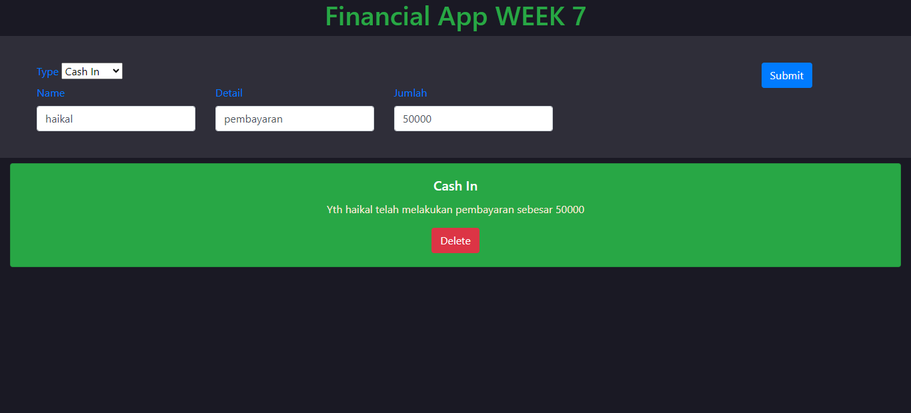

# TUGAS DOM TYPESCRIPT ( WEEK 7 MUHAMMAD HAIKAL SHAHAB) 

# Eksplorasi ke dalam HTMLElement tipe 
Dalam 20+ tahun sejak standarisasinya, JavaScript telah berkembang sangat jauh. Meskipun pada tahun 2020, JavaScript dapat digunakan di server, dalam ilmu data, dan bahkan di perangkat IoT, penting untuk mengingat kasus penggunaannya yang paling populer: browser web.

Situs web terdiri dari dokumen HTML dan/atau XML. Dokumen-dokumen ini statis, tidak berubah. Document Object Model (DOM) adalah antarmuka pemrograman yang diterapkan oleh browser untuk membuat situs web statis berfungsi. DOM API dapat digunakan untuk mengubah struktur, gaya, dan konten dokumen. API sangat kuat sehingga kerangka kerja frontend yang tak terhitung jumlahnya (jQuery, React, Angular, dll.) Telah dikembangkan di sekitarnya untuk membuat situs web dinamis lebih mudah dikembangkan.

TypeScript adalah superset JavaScript yang diketik, dan mengirim definisi tipe untuk DOM API. Definisi ini sudah tersedia di proyek TypeScript default apa pun. Dari 20.000+ baris definisi di lib.dom.d.ts , ada yang menonjol di antara yang lain: HTMLElement. Jenis ini adalah tulang punggung untuk manipulasi DOM dengan TypeScript.

## FASILITAS CODING DOM
- HTML
- CSS
- JavaScript
- Typescript

## CSS TEMPLATE
- Bootstrap(CARD,BUTTON)

## Deployment
You Can Click Site: [https://haikalshahab7.netlify.app](https://haikalshahab7.netlify.app).

  

